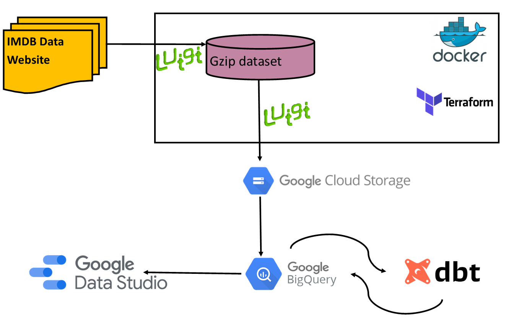

# Data Engineering Project: IMDB Data

## Dataset
[IMDB Datasets](https://www.imdb.com/interfaces/)

## Problem Statement

Use IMDB dataset for the following analyses:

* Distribution of movie types in 2022?
* What is the trend of movie types (theater release vs TV) from 1990 to date?

## Technology Stack

* Docker
* Terraform
* Luigi
* GCP
* BigQuery
* DBT
* Google Data Studio

## Architecture Diagram

## Data Pipeline

The IMDB dataset refreshes daily, so a batch pipeline has been created using [Luigi](https://luigi.readthedocs.io/en/stable/).

Luigi is an orchestration tool written in Python, which can be used for batch pipelines of all kinds. I chose Luigi for two reasons, one is that it very lightweight compared to Airflow. The installation only requires Python, and there is no need to install dependencies like Redis or PostgreSQL. Another reason for choosing Luigi was simply to try something different. 

The best part of Luigi is that everything is written as code as opposed to configuration files, and this allows for defining complex logic much more easily. There is no scheduler included in the tool, and cron jobs are used for scheduling jobs. I liked this better as the jobs are run on demand, as opposed to having a Docker container for Airflow running always. The only drawback of Luigi for me was the lack of documentation, especially for the GCS module. I had to understand the usage pretty much by reading the python code. In particular, I did not find any mention about the python package requirements for using the GCS module. I had to go through the code to figure out what to get installed. 

The major drawback of Luigi was getting it to overwrite the GCS blobs in each run. By default Luigi checks for task completeness based on the presence of the target, which is the final parquet files in GCS. I had to write a separate script which delete the previous blobs from GCS before the current day run is triggered.

As mentioned above, the Luigi pipeline is scheduled using cron jobs, and will download the dataset using wget, extract the gzip archive, convert to parquet file and then upload the parquet files to Google Cloud Storage.

## Steps to run data ingestion pipeline

To run this projects, the following software should be installed in the system:

* Docker
* Terraform

### Step 1: Clone the repository

~~~sh
git clone https://github.com/JishnuNair/data_engineering.git
~~~

### Step 2: Provison GCP assets using Terraform

**Prerequisite**: Extract GCP service account json authentication file, and create environment variable GOOGLE_APPLICATION_CREDENTIALS which points to this file. 

Refer: [GCP documentation on Service Account keys](https://cloud.google.com/docs/authentication/production)

~~~sh
cd data_engineering/7_project/terraform
terraform init
terraform apply
~~~

### Step 3: Run Data ingestion pipeline

Note: Before running docker_run.sh, edit the location of google application credentials json file

~~~sh
cd data_engineering/7_project
./docker_run.sh
~~~

This step can be scheduled as a cron job.

## Data Warehouse: BigQuery

Tables have been created in BigQuery based on the parquet files loaded to GCS. The ddl scripts are available in src/bq_create_tables.sql

The data volumes for this dataset do not justify the use of partitioning on the data. Only clustering has been included in two of the larger tables.

## Data Transformation: DBT

Further data transformations are done in DBT to prepare the data for visualizations which address the problem statements.

The main transformation done in this scenario is the aggregation of titles based on release year, region and type of title. 

## Dashboard

[IMDB Analysis](https://datastudio.google.com/s/i5nOxQ1nC80)

## TODO

* Add documentation, unit tests to DBT models
* Implement SCD logic for data ingestion